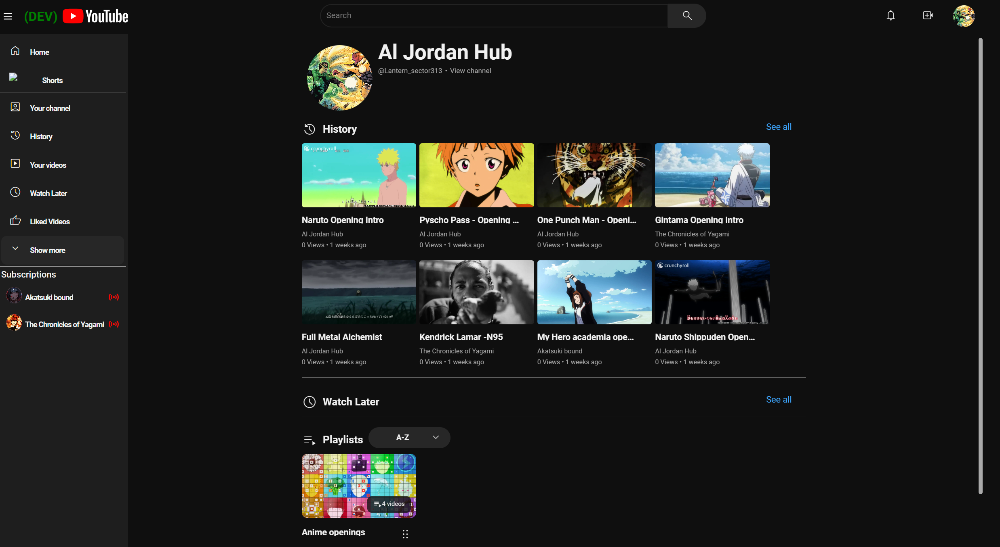
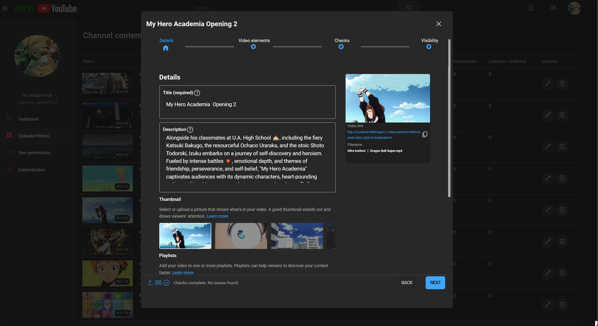

# youtube-clone-angular
An application replicating some of youtube's functionalities using Angular, Typescript and Java:Spring

# My Youtube Clone

## Loading animation 

## Introduction

This project works on building an application that emulates some of youtube's functionalities using Angular, Typescript on the front-end and Java with MySQL on the backend.

### History 

### Watch Later

Here a example of a the Watch Later playlist without data.

### Show More Playlists

### Watch

Here is a view of a video (psycho-pass season 1 opening) streaming using adaptive bit-rate, getting video segments from the spring backend. This adaptive approach to streaming allows you to change the video bitrate (quality) on the fly. 

### Watch description

Here you can see the description of the video being watched.

### Comment and Sub comment

The Comment section below shows you comment and subcomments.

### Playlist View

This is the playlist view for any playlist. The playlist is sortable and able to maintain the new order in the database. The thumbnail automatically extracts and adjusts the color gradient of the metadata container on the right

## User dashboard

In the below section you can see the user dashboard section, where a user can upload a video to the server. 

### Dashboard

### Uplaoded Video

In this section you can interact with the videos you have uploaded. Such as: Changing their visibility status, title, description, the playlist you want to place them in, etc.

### Your permissions

Here you can see the section allowing you to interact with the available permissions set.

### Customization 

In the section below you can update your channel's thumbnail and banner.

In the section below you can see how to update the your channel metadata.

